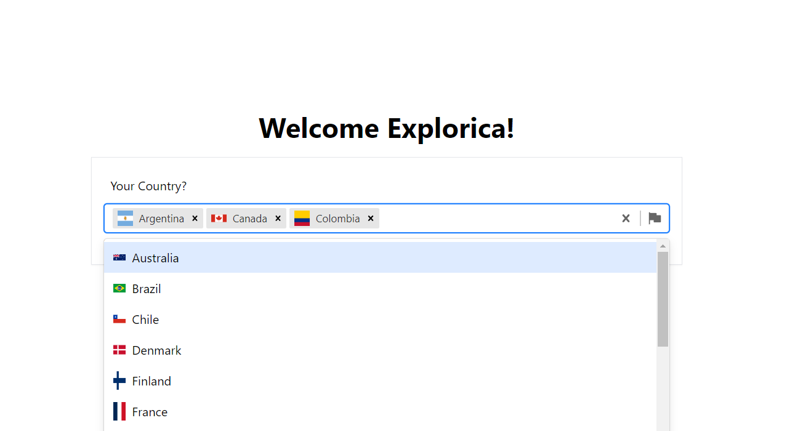

## Country Select 
This is my solution for country select assignment.

## Run Locally

Clone the project

```bash
git clone
```

Go to the project directory

```bash
cd country-select
```

Run the api by following the instructions in api/README.md file.

then 

Run the frontend by following the instructions in frontend/README.md file.

Now you can visit http://localhost:3000 from your browser to see the result.

Here's screenshot of the app:


## Tech Stack
* NextJs/ReactJs/TailwindCss - **Frontend**
* Flask/MongoDB - **Backend**